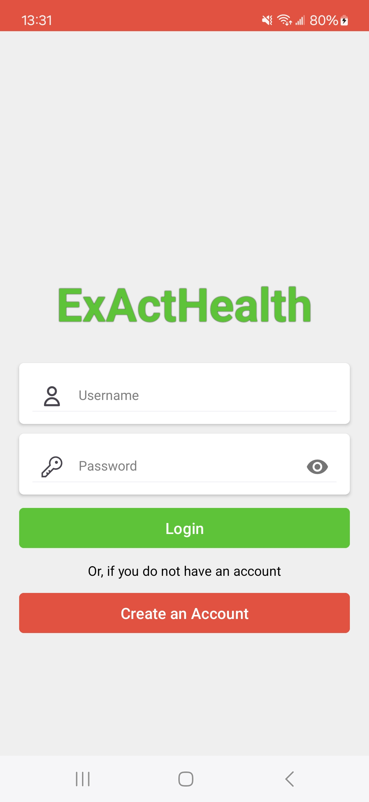
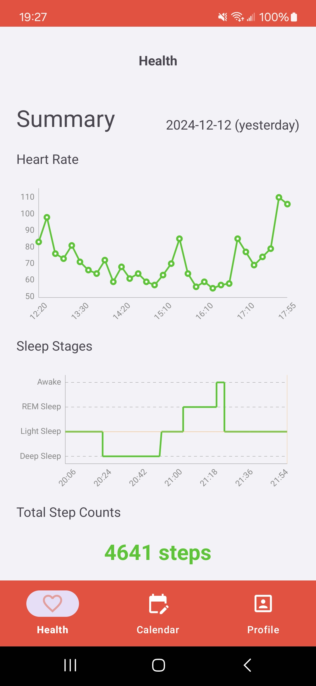
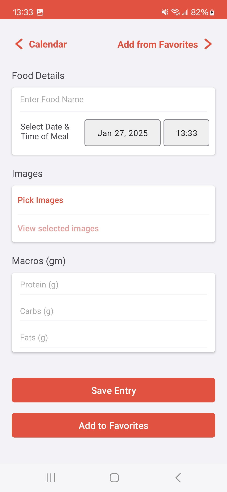
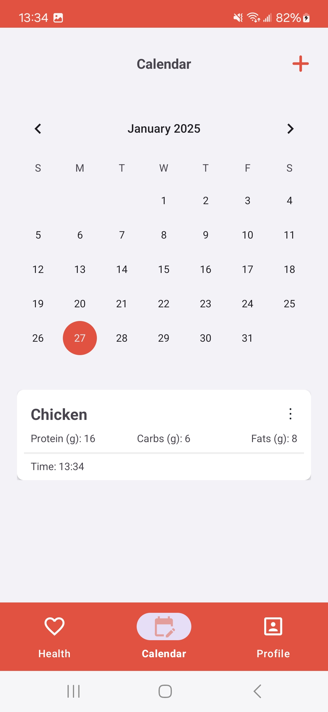

# ExActHealth

An Android app for longitudinal health and nutrition data collection. It reads
smartwatch metrics through [Health Connect](https://developer.android.com/health-and-fitness/guides/health-connect),
lets participants log meals with photos and macros, and syncs everything to a
study backend.

Built as the data-collection client for a research trial. The Android client is
released here; the server it talked to is not public.

> [!IMPORTANT]
> **This app does not ship with a working backend.** The server URLs in the
> source are placeholders and will not respond. To run this app you must stand
> up your own server implementing the API described in
> [Server API](#server-api), then point the app at it.

---

## Screenshots

<p align="center">
  
  
  
  
</p>

<p align="center"><em>Login &nbsp;·&nbsp; Health summary &nbsp;·&nbsp; Add food entry &nbsp;·&nbsp; Calendar</em></p>

---

## Features

**Health data (via Health Connect)**
- Heart rate, step counts, sleep stages, exercise sessions, and calories burned
- Daily summary screen with charts for heart rate and sleep stages
- Reads from any app that writes to Health Connect (Samsung Health, Fitbit, Google Fit, …)

**Nutrition logging**
- Log meals by name, date, and time
- Macro entry: protein, carbs, fats
- Attach photos to a meal; images are compressed before upload
- Save frequently eaten meals as favorites for one-tap re-entry

**Sync and offline behavior**
- Session-based auth with CSRF tokens and cookies
- Local caching in `SharedPreferences`; reads fall back to the local copy when the server is unreachable
- Connectivity checks with distinct messages for no-internet, timeout, and server-down

---

## Requirements

| | |
|---|---|
| **Min SDK** | 28 (Android 9) |
| **Target / Compile SDK** | 34 |
| **Language** | Kotlin |
| **Build** | Gradle 8.4, Android Gradle Plugin 8.x |
| **Java** | 8 (source/target compatibility) |

**On the device:**
- [Health Connect](https://play.google.com/store/apps/details?id=com.google.android.apps.healthdata) installed. The app detects when it's missing and redirects to the Play Store.
- A data source writing into Health Connect — a paired smartwatch plus its companion app (e.g. Samsung Health with a Galaxy Watch), or any other Health Connect-compatible app.
- Health Connect permissions granted to **both** ExActHealth and the source app. Data won't appear if the source app isn't permitted to write.

**Permissions requested:**

`INTERNET`, `ACCESS_NETWORK_STATE`, `CAMERA`, `READ_MEDIA_IMAGES`, `READ_MEDIA_VIDEO`, and the Health Connect read permissions for heart rate, steps, sleep, exercise, active calories, and total calories.

---

## Setup

### 1. Point the app at your server

Server URLs live as constants in two files:

- `app/src/main/java/com/example/exacthealth/classes/ServerRequestHandler.kt` — data and image endpoints
- `app/src/main/java/com/example/exacthealth/activities/LoginActivity.kt` — connection, login, and sign-up endpoints

Every constant shares the same base URL, so replacing that base with your own
across the two files is enough.

### 2. Build

```bash
git clone <your-fork-url>
cd ExActHealth-Android
./gradlew assembleDebug
```

Or open the project in Android Studio and run it on a device. A physical device
is strongly recommended — Health Connect and smartwatch data don't work
meaningfully on an emulator.

### 3. First run

1. Launch the app and create an account (this calls your `sign-up/` endpoint).
2. Install Health Connect if prompted.
3. Grant ExActHealth all requested Health Connect permissions.
4. Confirm your watch's companion app is permitted to **write** to Health Connect.
5. Return to ExActHealth. The Health tab shows yesterday's summary once data syncs.

---

## Server API

The app expects a session-based HTTP backend. Every request is
`application/x-www-form-urlencoded` (except image upload, which is
`multipart/form-data`), and every authenticated request carries the session
cookie plus a CSRF token obtained from `testConnection/`.

The reference implementation was Django, which is why the CSRF parameter is
named `csrfmiddlewaretoken` — but nothing in the client requires Django. Any
framework works as long as it matches the contract below.

### Authentication flow

1. `GET testConnection/` on app start. The server returns HTML containing a
   hidden input, and a `Set-Cookie` header.
2. The app extracts the token by string-matching
   `name="csrfmiddlewaretoken" value="..."` and stores it alongside the raw
   `Set-Cookie` value.
3. Both are attached to every subsequent request — cookie as the `Cookie`
   header, token as a `csrfmiddlewaretoken` form field.

> [!NOTE]
> The token is parsed out of an HTML response by substring match, not from JSON.
> If you build a fresh backend, either emit that exact hidden-input markup or
> adjust `LoadingActivity.testConnection()` to read your format.

### Endpoints

All paths are relative to the configured base URL.

| # | Path | Method | Form parameters |
|---|---|---|---|
| 1 | `testConnection/` | GET | — |
| 2 | `sign-up/` | POST | `username`, `password`, `csrfmiddlewaretoken` |
| 3 | `login/` | POST | `username`, `password`, `csrfmiddlewaretoken` |
| 4 | `update-food-list/` | POST | `username`, `csrfmiddlewaretoken`, `food_date`, `food_list` |
| 5 | `get-food-list-from-date/` | POST | `username`, `csrfmiddlewaretoken`, `food_date` |
| 6 | `upload-image/` | POST | *multipart:* `username`, `csrfmiddlewaretoken`, `image_date`, `file` |
| 7 | `send_heartrate_data/` | POST | `username`, `csrfmiddlewaretoken`, `heartrate_date`, `heartrate_list` |
| 8 | `get-heartrate-list-from-date/` | POST | `username`, `csrfmiddlewaretoken`, `heartrate_date` |
| 9 | `send_stepcounts_data/` | POST | `username`, `csrfmiddlewaretoken`, `stepcounts_date`, `stepcounts_list` |
| 10 | `get-stepcounts-list-from-date/` | POST | `username`, `csrfmiddlewaretoken`, `stepcounts_date` |
| 11 | `send-sleepstage-data/` | POST | `username`, `csrfmiddlewaretoken`, `sleepstage_date`, `sleepstage_list` |
| 12 | `get-sleepstage-list-from-date/` | POST | `username`, `csrfmiddlewaretoken`, `sleepstage_date` |
| 13 | `send-exercise-data/` | POST | `username`, `csrfmiddlewaretoken`, `exercise_date`, `exercise_list` |
| 14 | `send-calories-data/` | POST | `username`, `csrfmiddlewaretoken`, `calories_date`, `calories_list` |
| 15 | `get-calories-list-from-date/` | POST | `username`, `csrfmiddlewaretoken`, `calories_date` |

> [!WARNING]
> Path naming is inconsistent — endpoints 7 and 9 use underscores
> (`send_heartrate_data`, `send_stepcounts_data`) while the rest use hyphens.
> This is preserved as-is to match the original server. Match it exactly, or
> change both the paths and the constants together.

Exercise sessions are upload-only; there is no corresponding read endpoint.

### Conventions

- **Dates** are strings in `YYYY-MM-DD` format.
- **`*_list` parameters** are JSON arrays serialized to a string.
- **`food_date`** accepts the literal value `None` instead of a date, which
  addresses the user's *favorite foods* list rather than a specific day.

### Response formats

Send endpoints need only return HTTP `200` on success. Any other code is
treated as a failure, and the app falls back to its local cache.

Get endpoints return a **plain-text prefix followed by a JSON array**. The
client strips the prefix with a regular expression and parses the remainder:

| Endpoint | Expected response shape |
|---|---|
| `get-food-list-from-date/` | `Food entries for <date>: [...]` |
| `get-heartrate-list-from-date/` | `Heart rate entries for <date>: [...]` |
| `get-stepcounts-list-from-date/` | `Step count entries for <date>: [...]` |
| `get-sleepstage-list-from-date/` | `Sleep stage entries for <date>: [...]` |
| `get-calories-list-from-date/` | `Calories entries for <date>: [...]` |

### Auth status codes

Login and sign-up use custom codes to drive the on-screen message. The response
body is displayed to the user verbatim, so return a human-readable string.

**Login** — `201`–`205` reserved

| Code | Meaning |
|---|---|
| `200` | Success |
| `201` | Username does not exist |
| `202` | Wrong password |

**Sign-up** — `206`–`209` reserved

| Code | Meaning |
|---|---|
| `200` | Success |
| `206` | Username already taken |
| `207` | Username invalid (min 3 chars, letters and numbers only) |
| `208` | Password invalid (min 8 chars) |

---

## Project structure

```
app/src/main/java/com/example/exacthealth/
├── activities/          Login, Loading, Calendar, food entry, image screens
├── fragments/           Health, Calendar, and Profile tabs
├── models/              ViewModels per health metric
└── classes/
    ├── ServerRequestHandler.kt   All server communication
    ├── Health.kt                 Health Connect models + local caching
    ├── Food.kt                   Food entry models
    ├── Helper.kt                 Connectivity checks and dialogs
    ├── GsonProvider.kt           JSON serialization
    └── AdapterHelper.kt          RecyclerView adapters
```

**Key dependencies:** AndroidX Health Connect client, MPAndroidChart, Gson,
Jackson, OkHttp, Lottie.

---

## Notes for reuse

This was built for a specific research deployment, and a few things reflect
that rather than general best practice:

- Network calls run on the main thread with a permissive `StrictMode` policy.
- Credentials are cached in `SharedPreferences` and the password is displayed on
  the Profile screen — a deliberate choice for a supervised trial, and one you
  should change before any wider deployment.
- Server responses are parsed by string matching rather than structured JSON.

Worth knowing before you build on it. The Health Connect integration, chart
rendering, and offline-fallback logic are the parts most likely to be useful
elsewhere.

---

## License

See [LICENSE](LICENSE).
